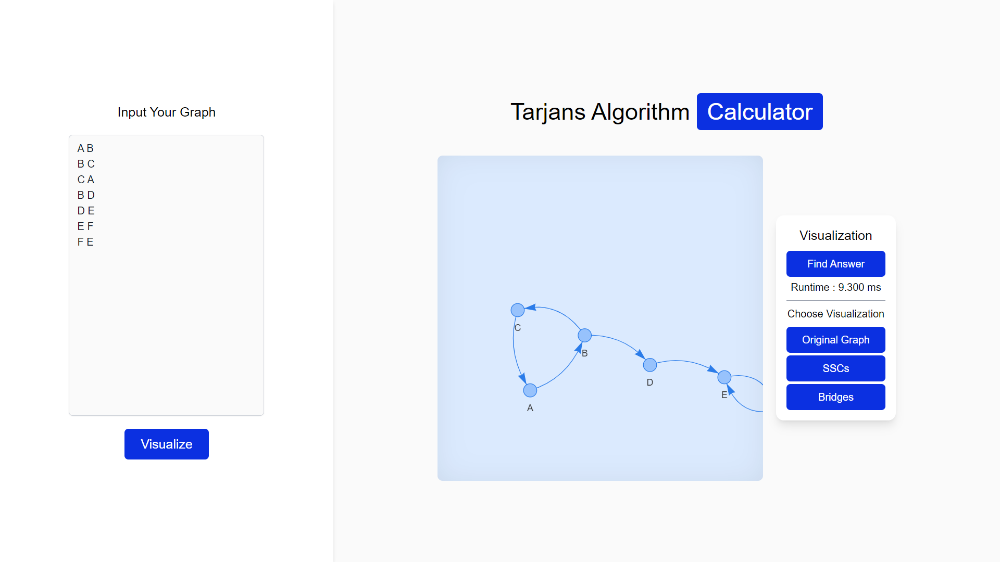
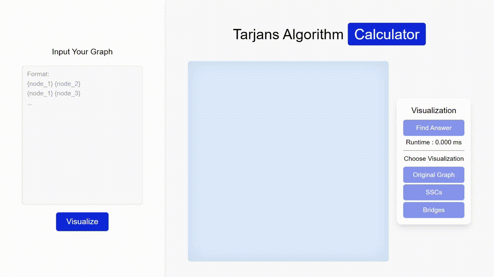
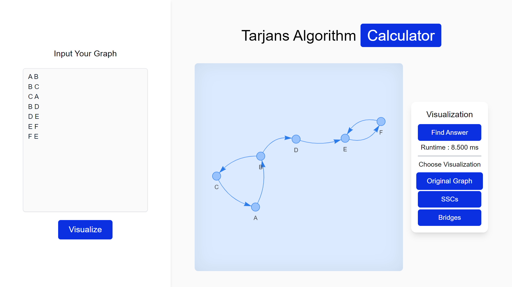
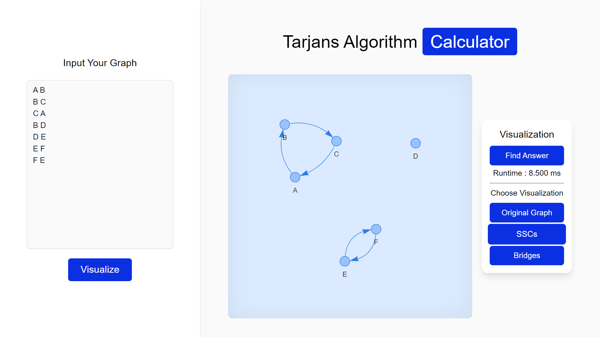
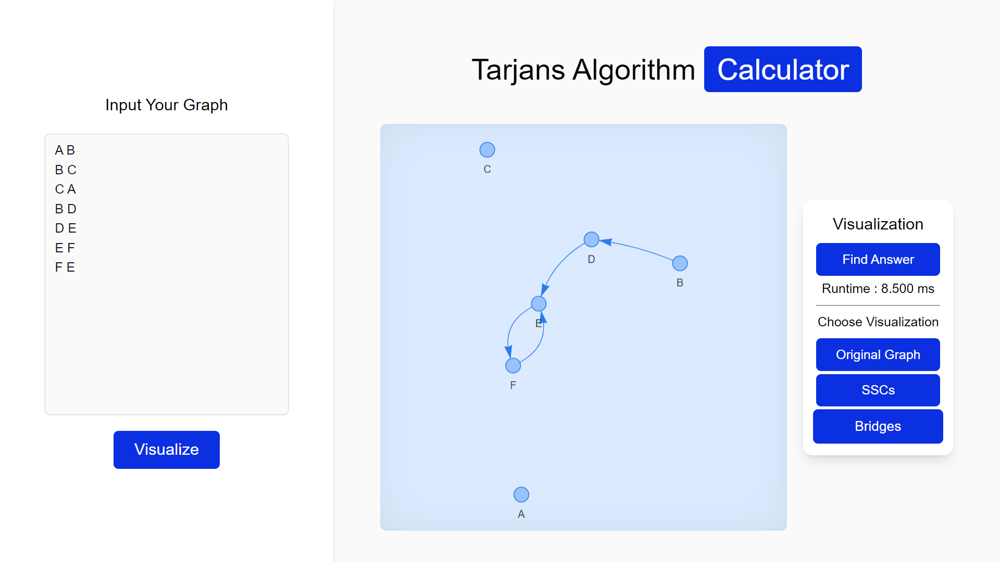

# Tarjans Algorithm Calculator

Tarjans Algorithm Calculator is a fullstack web application built using React, TypeScript, and Tailwind CSS for frontend and Go with Gin for backend. The app provides functionality to calculate the Strongly Connected Components (SSC) and Bridges of a graph using the Tarjans Algorithm.

## Table of Contents

- [Algorithm](#algorithm)
- [Features](#features)
- [Installation](#installation)
- [Usage](#usage)
- [Framework](#framework)
- [Contributing](#contributing)
- [Contact](#contact)
- [References](#references)

## Algorithm

Tarjan's Algorithm is a powerful graph algorithm used to find strongly connected components (SCCs) in a directed graph. It was proposed by Robert Tarjan in 1972 and has numerous applications in graph theory and network analysis.

### Complexity of Tarjan's Algorithm

The time complexity of Tarjan's Algorithm is O(V + E), where V is the number of vertices (nodes) in the graph and E is the number of edges. The algorithm efficiently identifies SCCs, making it a popular choice for problems involving strongly connected components.

### Modification for Detecting Strong Bridges

Tarjan's Algorithm can be extended to identify strong bridges, which are edges that, if removed, increase the number of SCCs in the graph. To detect strong bridges, we augment the original algorithm to track "low" values during the Depth-First Search (DFS) traversal. An edge (u, v) is a strong bridge if the "low" value of the destination vertex v is greater than or equal to the "discovery" value of the source vertex u.

### Types of Edges in the Graph

- `Back Edge`, A back edge is an edge (u, v) that connects a vertex u to an ancestor v in the DFS traversal tree. It forms a cycle in the graph and helps to identify SCCs.
- `Cross Edge`, A cross edge is an edge (u, v) that connects two vertices u and v that are neither ancestors nor descendants of each other in the DFS traversal tree. Cross edges do not form a cycle and typically link two different SCCs.
- `Forward Edge`,A forward edge is an edge (u, v) that connects a vertex u to a descendant v in the DFS traversal tree. It points to a vertex in the future (in terms of DFS traversal) and does not form a cycle.
- `Tree Edge`,A tree edge is an edge (u, v) that connects a vertex u to its child v in the DFS traversal tree. Tree edges help to build the DFS tree structure during the algorithm's execution.

## Features

- `Graph Input`: Users can input edges to form a graph visually or through text. They can add, edit, or remove edges to create custom graphs for analysis.
- `Visualization`: The web app offers interactive visualization of the input graph, displaying nodes and edges with intuitive representations. Users can easily grasp the graph's structure and connections.
- `Strongly Connected Components (SSC) Detection`: application can identify and highlight strongly connected components in the input graph. Users can easily observe the components separately through visual representations.
- `Bridges Detection`: The web app can identify and visualize the bridges (strong bridges) in the graph. Users can see the critical edges that, if removed, will increase the number of connected components.

## Installation

Prerequisites:

1. Go v 1.20.6
2. Node v 18.13.0

Steps to Use the Web App:

1. Clone this repository or download it as a zip file.
2. Open the root folder of the downloaded repository and navigate to the `./server` directory.
3. Create a new .env file in the `./server` directory and set the environment variable PORT with the value 3000.
4. On your terminal or command prompt, run the `CompileDaemon -command="./server"` to start the server using CompileDaemon.
5. Leave the terminal running with the server active.
6. Open the root folder of the downloaded repository and navigate to the `./client` directory.
7. On your terminal or command prompt, run the `npm run dev` to start the client.
8. After starting the client, open your web browser and visit http://localhost:5173/.

## Usage

### Graph Input

### Visualization

### SSC Visualization

### Bridge Visualization

## Framework

- `Frontend` : React, Typescript, axios, vis-network
- `Backend` : Go, Gin, net/http

## Contributing

Mohammad Farhan Fahrezy

## Contact

- [Personal Website](https://farhanfahreezy.site/)
- [Linkedin](https://www.linkedin.com/in/farhanfahreezy/)

## References

- Bridges: https://www.youtube.com/watch?v=Rhxs4k6DyMM&t=866s
- SSCs: https://www.youtube.com/watch?v=wUgWX0nc4NY
- Gin tutorial: https://www.youtube.com/watch?v=lf_kiH_NPvM
